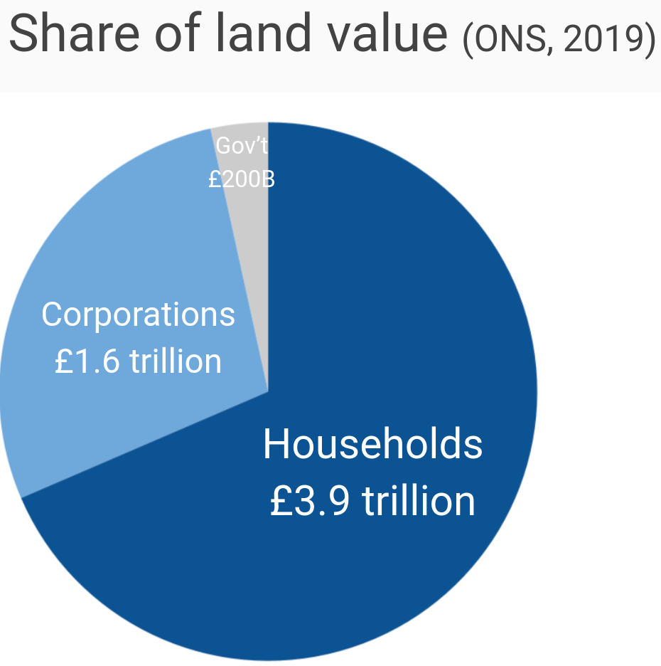
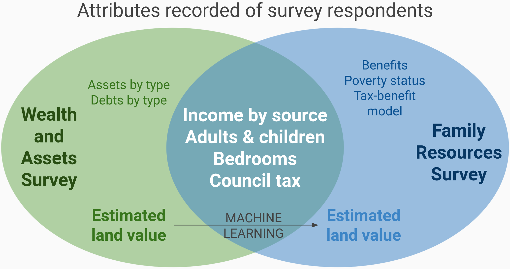

## Imputing land value to the FRS

No UK dataset directly estimates land value alongside income, but we pieced together multiple datasets to estimate it:

* **An ONS summary** contains land value by sector.
* **The Wealth and Assets Survey (WAS)** contains income, demographics, and wealth by asset type (but not land value).
* **The Family Resources Survey (FRS)** contains income, benefits, and demographics (but not wealth); it is the core dataset for most distributional analysis.

We started by combining the ONS summary with the WAS to estimate land value for each household in the WAS.
Of the £5.7 trillion in total land value, the ONS reports that £3.9 trillion is held by households, £1.6 trillion is held by corporations, and the remaining £200 billion is held by governments.

The WAS, meanwhile, sums to £6.2 trillion in property wealth and £4.9 trillion in corporate wealth.
Dividing the respective values shows that households have 62p of land for each £1 in property wealth, and 33p of land for each £1 in corporate wealth.
We estimate the land value of each household using these factors, producing land value that sums to the £5.5 trillion in non-government land wealth.

<table>
  <tr>
   <td><strong>Household</strong>
   </td>
   <td><strong>Property wealth</strong>
   </td>
   <td><strong>Corporate wealth</strong>
   </td>
   <td><strong>Estimated land value</strong>
   </td>
  </tr>
  <tr>
   <td>1
   </td>
   <td>£x
   </td>
   <td>£y
   </td>
   <td>0.62x + 0.33y
   </td>
  </tr>
  <tr>
   <td>...
   </td>
   <td>...
   </td>
   <td>...
   </td>
   <td>...
   </td>
  </tr>
  <tr>
   <td><strong>Total</strong>
   </td>
   <td><strong>£6.2tn</strong>
   </td>
   <td><strong>£4.9tn</strong>
   </td>
   <td><strong>£5.5tn</strong>
   </td>
  </tr>
</table>

Given the estimated land value for each household in the WAS, our next task was to map it to households in the FRS, the core dataset for our analysis.
We applied our [synthimpute](https://github.com/PSLmodels/synthimpute/) Python package, which imputes data from one source to another using skewed random forests quantile regression.
Specifically, we built a nonparametric prediction model from the WAS of land value, based on several household characteristics common to the WAS and FRS[^predictors], then used that model to sample from each FRS household's predicted distribution.
To ensure that the total in the FRS matched the £5.5 trillion in land value, we introduced bias to sample from the predicted distribution using the Beta distribution.

[^predictors]:  Our model of WAS land value used the following predictors: gross income, number of adults, number of children, pension income, employment income, self employment income, investment income, number of bedrooms, council tax, and whether the household rents.

